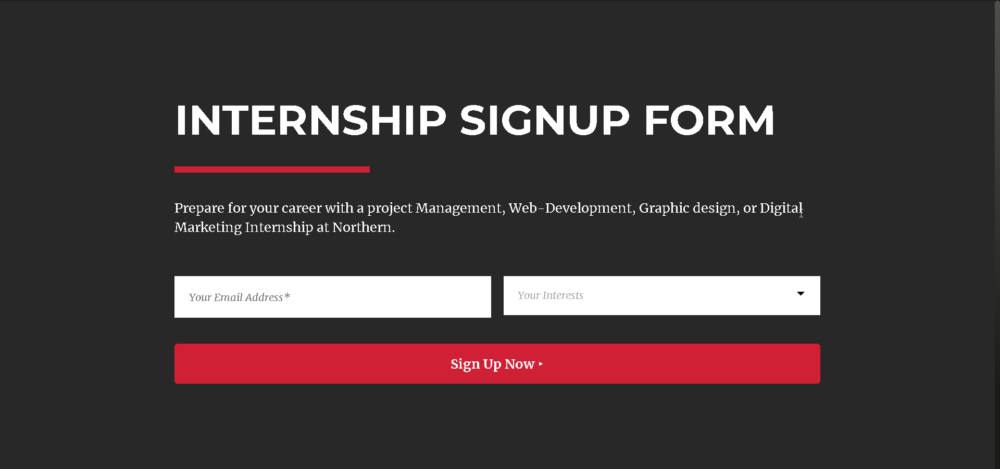
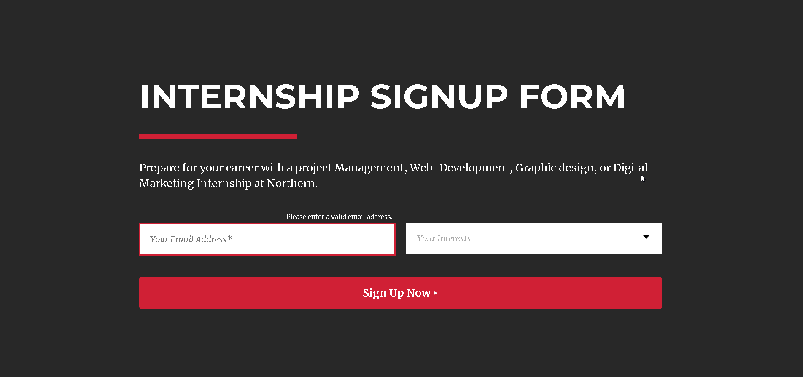
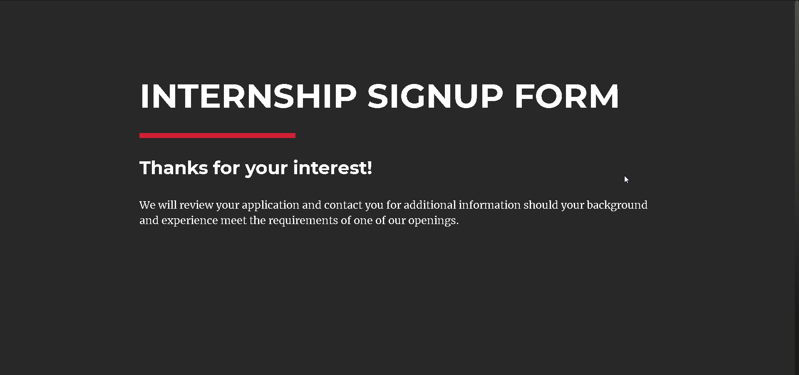
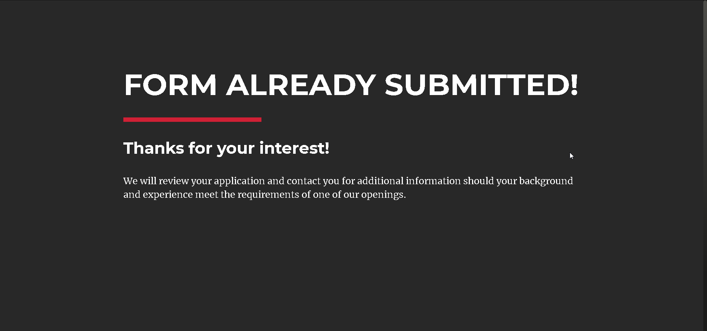

# Northern Form Coding Challenge with React and Sass

 Main form to be displayed when the page is loaded

     

 Errors to be displayed if validation doesn't submit the form

 Thank you page to be displayed

 Already Submitted page with localStorage if user tries to submit the form again

1) Firstly, I have implemented the design as per the prototype with Sass and JSX in React.js and then React components.
2) Secondly, I have done the main logic of the form with states in useForm component and preventing the default submission 
    plus, useEffect inside the component is going to display errors if there are any or allow us to sumbit if no errors.
3) When it comes to validation, if the value of email or the value of email doesn't match the pattern throw an error with a red border and a message to enter their email appears.
4) If error is not successfull then the form success will appear and the data on the console of the browser as an object.
   But when it takes us to another component of AlreadySubmitted then we cannot see the values of  the Object.
   To be directed to the component of AlreadySubmitted you need to refresh the page on FormSucess component or Thank you page.
5) I get the values for email and interests input boxes and store them in an object.
6) Insert the email input data into localStorage for further validation in order not to allow another submission while refreshing the page.
7) When you clear the localStorage with localStorage.clear() on the console, then you can refresh and go back to the main form again.
8) As mentioned earlier the main logic here, if isLoaded component not true, Sign up Now button else it changes to Submitting ellipsis.
9) Every 2 seconds, setTimeout method makes the magic button ellipsis work but main true false logic.
    // happens in FormSignup.js where I use the state of isLoaded
10) Using a ternary operator while retruning the form or displaying it and in some other parts instead of if else to have cleaner code. 
     If submitted not true then form sing up page else form success page or success page component.
11) Implemented cross browser compatibility including mobile browsers and IE Browser support
12) Hosting done with Firebase

In order to run the project directory, you can run:

### `npm start`

Runs the app in the development mode.\
Open [http://localhost:3000](http://localhost:3000) to view it in the browser.
